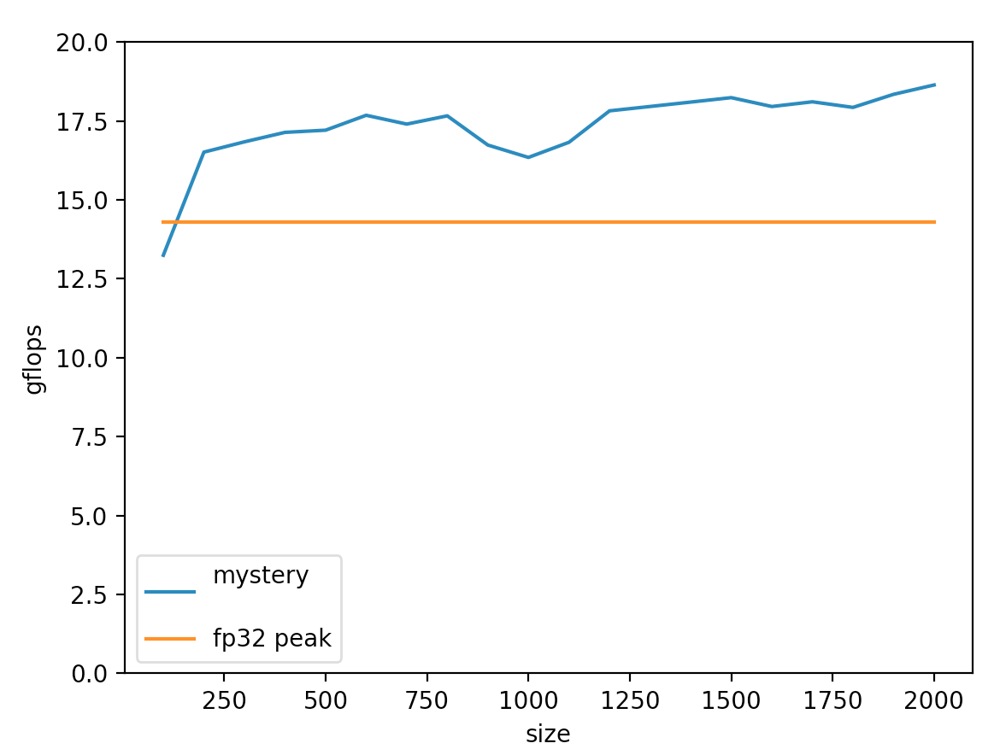
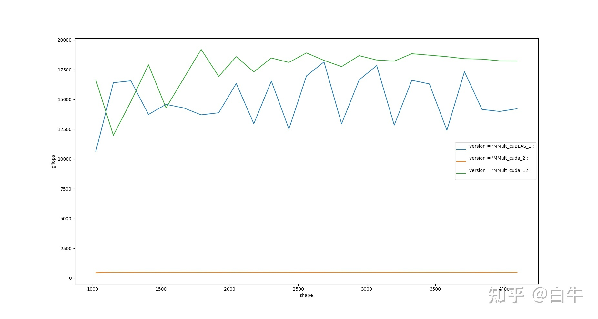

# how-to-optimize-gemm

English | [简体中文](README_ZH_CN.md)

## News

2023/08 aarch64 add cmake and mperf, try `-DMPERF_ENABLE=ON` !

## Introduction

row-major matmul optimization tutorial

| backend | armv7 | aarch64 | aarch64-int8 | cuda | cuda-int4 | vulkan | x86 |
| ----------- | ------- | -- | ---------- | ---------- | ---------- | --------- | --- |
| support | ✔️ | ✔️ | ✔️ | ✔️ | - | ✔️ | ✅ | 

All backends and corresponding tutorials

| backend | tutorial |
| ------- | -------- |
| aarch64 | [GEMM 入门](https://zhuanlan.zhihu.com/p/65436463) |
| aarch64 | [GEMM caching](https://zhuanlan.zhihu.com/p/69700540) |
| aarch64-int8 | - |
| armv7   | [ARMv7 4x4kernel 懒人优化小实践](https://zhuanlan.zhihu.com/p/333799799) |
| cuda    | [cuda 入门的正确姿势：how-to-optimize-gemm](https://zhuanlan.zhihu.com/p/478846788) |
| cuda-int4 WIP | [int4 炼丹要术](https://zhuanlan.zhihu.com/p/580752390)
| vulkan  | [如何火急火燎地上手 Vulkan](https://zhuanlan.zhihu.com/p/487583258) |


## Build and run

Usage is similar for all backends:

1. Open the backend directory to be used, and change the `OLD` and `NEW` of `makefile` to the same implementation for the first run, for example

```bash
$ cd aarch64
$ cat makefile
OLD    := MMult_4x4_10
NEW   := MMult_4x4_10
..
```

2. makefile` will compile and run the implementation which `NEW` point at, and copy `output_MMult_4x4_10.m` to `output_new.m`
```bash
$ make run
$ cat output_new.m
```

3. It may not be intuitive to look at the numbers directly, so draw a line chart
```bash
$ python3 -m pip install -r ../requirements.txt
$ python3 plot.py
```

## Differences between backends

Specific to each hardware, there are subtle differences:
* `NEW` may choose a different name
* vulkan/int4 needs prerequisitions

## 1. armv7 and aarch64

A. Prepare armv7/aarch64 linux development environment, Raspberry Pi/rk3399/aws arm server are all fine.

B. By default `ARCH := native`, build and run directly
```
$ cd armv8 && make run
```

## 2. aarch64 int8

[chgemm](https://github.com/tpoisonooo/chgemm) is an int8 gemm library. 

* blue line is chgemm implementation
* orange line is aarch64 fp32 peak


Compared to the code in this tutorial, the differences are:
1. Dealing with the boundary problem, unlike the tutorial where only multiples of 4 are considered;
2. Int8 reaches a maximum of 18.6 gflops (relative to the theoretical limit of fp32 is only 14.3 on RK3399, gemmlowp is about 12-14gflops);
3. Based on symmetric quantization, input value range must be in \[-127, +127\], and -128 cannot appear;
4. Built-in small example about how to integrate into android studio

chgemm has been merged into [ncnn](https://github.com/tencent/ncnn) INT8 convolution implementation.


## 3. x86 original
[flame](https://github.com/flame/how-to-optimize-gemm/tree/4fcf39bd0963bca62f04bef2aeb49a06ee28508b) referenced by x86 is the original implementation, with some differences from this repo:

1. The original is **column-major** `x86 SSE` version
2. Both are tutorials, and the `MMult_4x4_17.c` written now can reach 70% of the armv8.1 CPU peak
3. The boundary problem is not dealt with now, only the case where MNK is a multiple of 4 is considered; `sub_kernel` also only writes the simplest kind of assembly. Practical needs a simple adjustment;
4. In terms of drawing, `octave` was discarded (it is too troublesome to configure the environment once for embedded devices), and `python` was used instead.

## 4. CUDA
This version is **faster than NVIDIA cuBLAS**

* green line is MMult_cuda_12 without tensorcore
* blue line is cuBLAS without tensorcore



1. Need to install cuda driver and nvcc by yourself
2. CPU OpenBLAS is required to be the baseline

```bash
$ apt install libopenblas-dev
```


## 5. Vulkan

1. vulkan build depends on kompute API packaging, see [vulkan build documentation](https://github.com/tpoisonooo/how-to-optimize-gemm/tree/master/vulkan) for details

2. More about how to learn compute shader

## 6. CUDA int4

WIP

## Some Tools

* [megpeak](https://github.com/MegEngine/MegPeak): For measuring hardware limit performance, support arm/x86/OCL..
* [perf](https://perf.wiki.kernel.org): Available in linux system tools, for system-level performance analysis and disassembly
* [YHs_Sample](https://github.com/Yinghan-Li/YHs_Sample): dalao 's implementation

* [mperf](https://github.com/MegEngine/mperf): optimization tools

## License
[GPLv3](LICENSE)
